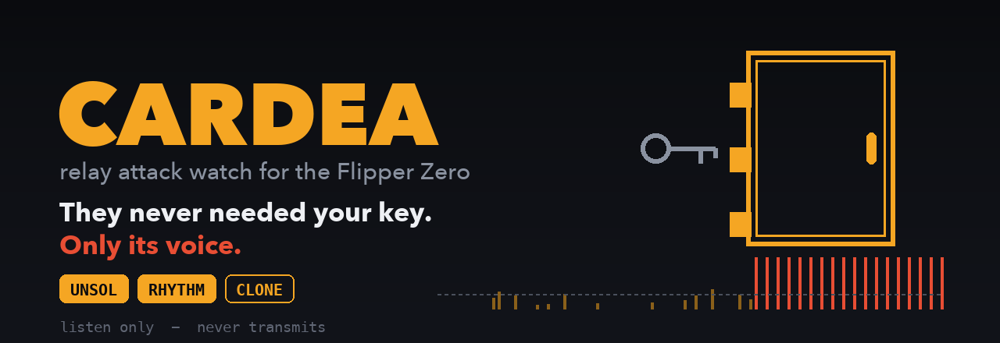
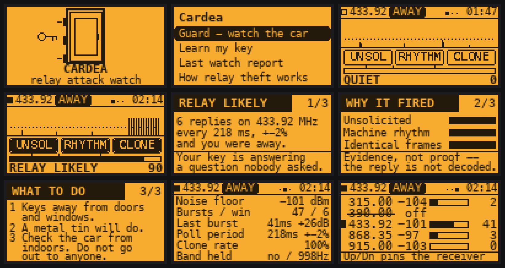
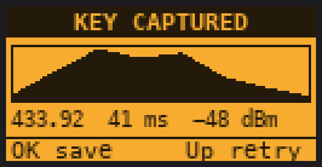
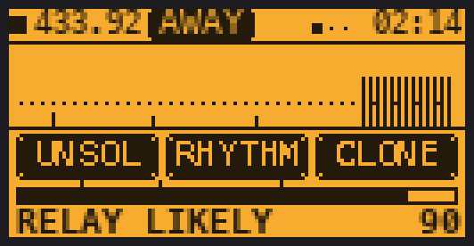
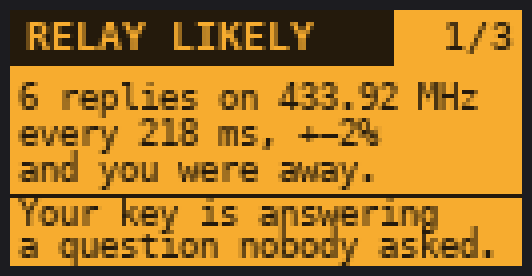

# Cardea

**Relay attack watch for keyless cars, on a Flipper Zero.**

Leave it in the car. Tell it you are walking away. It listens for your key
answering a question nobody asked.

[](https://github.com/at0m-b0mb/Cardea-FlipperZero/actions/workflows/build.yml)


---

## The claim, and why it is not absurd

A Flipper parked in a car can see a keyless theft happening thirty metres away,
through a house wall, **without hearing the part of the attack that is being
relayed.** That sounds wrong. Here is why it is true.

A passive-keyless car asks its key a question over a **125 kHz magnetic field**
from the door handle. That field reaches about a metre — it is near-field, and
its strength falls off with the cube of distance. The key answers over **UHF**:
315, 390, 433.92, 868 or 915 MHz depending on where the car was sold. That
answer is an ordinary radio transmission, built to unlock a car from across a
car park, and it carries hundreds of metres.

The common, cheap theft relays **only the question**. One person stands at the
car with a loop that picks up the 125 kHz challenge; a second stands by your
front door and re-radiates it there. Your key wakes up in the hallway and
answers.

**Nobody relays the answer, because nobody has to.** The key's UHF reply reaches
the car on its own — through the wall, across the drive, exactly as it was
designed to. That is what makes the attack practical with two cheap boxes.

It is also what leaves the attack audible from the driver's seat.

```
      YOUR HOUSE                                        YOUR CAR
   ┌───────────────┐                              ┌──────────────────┐
   │   key  ((o))  │ ── UHF reply, 100s of m ───► │  car    FLIPPER  │
   │        ▲      │      nobody relays this      │          ▲       │
   └────────┼──────┘                              └──────────┼───────┘
            │                                                │
       125 kHz, re-radiated                          this is what
       by the thief's box                            Cardea hears
            ▲                                                
            └──────── relayed by hand, box to box ───────────┘
```

So Cardea sits with the car and listens for a key that is answering when nobody
asked it anything.

## What it does

**Guard** hops every key band in the world — 315, 390, 433.92, 868.35, 915 MHz —
and camps on whichever one speaks. It pulls individual bursts out of the RSSI
stream and grades what it hears against three independent tests:

| Family | What it measures | Why it is evidence |
| --- | --- | --- |
| **UNSOL** | Key-shaped bursts while you have declared yourself away | Nobody was there to press anything |
| **RHYTHM** | Mean absolute deviation of the gaps, over their mean | A relay poller is a software loop. A thumb is not. |
| **CLONE** | Consecutive bursts of the same length, shape and strength | The same transmission, arriving again |

Then it says one of four things: **QUIET**, **ODD TRAFFIC**, **SUSPICIOUS**, or
**RELAY LIKELY** — and stops there. It never says "confirmed", because without
decrypting your key's reply there is no way to prove the burst came from *your*
key.

<p align="center">
  
</p>

## The rules that keep it honest

These are not editorial. Every one is enforced in `helpers/cdr_detect.c` and
pinned by a test in `test/host_detect_test.c`.

**One burst is never evidence.** Radios are noisy and your neighbour also owns a
key. The unsolicited ladder scores zero at one burst and zero at none.

**RELAY LIKELY needs two of the three families to agree.** One family, however
loud, tops out at SUSPICIOUS.

**One of the two has to be RHYTHM.** This rule was put there by a failing test,
not by taste. Picture yourself in your own hallway pressing your own key six
times: those bursts are unsolicited, because you told the app you were away, and
they are perfect clones of each other, because it is one key sending one frame.
Two families, sixty points, and nothing whatsoever has gone wrong. The metronome
is the only one of the three that a human hand does not produce, so the top
verdict is not allowed to do without it.

**A metronome that has been ticking for over a minute is furniture.** Weather
stations, tyre sensors and doorbell repeaters are all perfectly periodic and
perfectly innocent. Past sixty seconds the BEACON flag fires, RHYTHM and CLONE
stop scoring, and UNSOL is halved — so a weather station settles at ODD TRAFFIC
with a tag on it instead of screaming all night. *The cost, stated plainly: an
attacker who kept a metronome-steady poll running for over a minute would be
down-weighted. No relay tool behaves that way, and the trade buys immunity to
every periodic sensor on the street.*

**The score is capped at 92.** The three ceilings sum to 90. There is no
measurement here that deserves 100.

**Given those weights, RELAY LIKELY can only ever be reached while armed.**
RHYTHM and CLONE together are 50, and the threshold is 60. That is a property of
the arithmetic, and there is a randomised test asserting it over three thousand
generated situations.

**A held band is reported separately.** A carrier sitting on a band gets its own
HELD tag and is never folded into the score — partly because it may be the
attacker's own link, and partly because it blinds the burst detector, which you
deserve to be told rather than left staring at a reassuringly quiet screen.

## What it cannot do

- **It cannot hear the 125 kHz half.** Nothing on a Flipper can, at that range —
  the LF antenna is tuned for RFID at contact distance, not for sensing a relay
  coil across a driveway. Cardea watches the UHF half, which is the half that
  travels.
- **It cannot decrypt your key's reply.** Passive-entry responses are
  manufacturer-proprietary and rolling. Cardea matches on *duration, envelope
  shape and band* — not on content.
- **It cannot prove a burst was your key**, only that it was shaped like it.
- **It cannot stop a theft.** It tells you one is being attempted.
- **A quiet screen is not proof nothing happened.** It hears one half of the
  attack, not both, and while hopping it is listening to roughly a fifth of each
  band at a time. A single 40 ms frame can be missed. A *train* cannot.

## Teach it your key

Optional, and the single biggest improvement available. Hold your key against
the Flipper and press LOCK twice; Cardea captures the burst, checks the second
press agrees with the first, and averages them.

<p align="center">
  
</p>

Without a learned key, "key-shaped" means anything from 4 to 150 ms on any band —
honest, but broad. With one, it means *one length, one envelope, one band*, and
every other remote in the street stops counting. Two agreeing presses are
required because one reading can be a reflection off the car body and two cannot.

## Using it

Put the Flipper somewhere in the car — glovebox, door pocket, under a seat —
open **Guard**, and walk away. It arms itself after the delay you set (10 s by
default) and resets its evidence window at that moment, so the walk to your front
door is not counted against you.

| Key | Does |
| --- | --- |
| **OK** | AWAY / HERE — the single most important control in the app |
| **Hold OK** | Mute. Silences the speaker and the motor, never the LED. |
| **← →** | Watch / Detail / Bands, and the alert's three pages |
| **↑ ↓** | Pin the receiver to one band, or return to hopping |
| **Back** | End the watch (the report keeps what it saw) |

AWAY is what makes an unexplained burst unexplained. While it reads HERE, your
own key accounts for everything and UNSOL scores nothing.

<p align="center">
  
  
</p>

**Reading the watch screen.** The strip is thirty seconds of history, one pixel
column per quarter-second, bar height being strength over the noise floor. The
dotted line is the level a burst has to clear before it counts at all — bars
below it were seen and deliberately not scored. The square at top-left is filled
while camped on a band and hollow while hopping.

Alerts and anything reaching SUSPICIOUS are appended to
`/ext/apps_data/cardea/events.csv`.

> **Battery.** The receiver runs continuously; expect a few hours on a charge.
> For an overnight watch, plug it into a power bank.

## Install

Download `cardea.fap` from [Releases](https://github.com/at0m-b0mb/Cardea-FlipperZero/releases)
and copy it to `/ext/apps/Sub-GHz/` on the SD card. It appears under
**Apps → Sub-GHz → Cardea**.

FAPs are firmware-API specific. This one is built against the release channel
(API 87.1) and is CI-checked against the dev channel too. If it refuses to
start, rebuild it against your firmware:

```bash
python3 -m pip install --upgrade ufbt && ufbt && ufbt launch
```

## Building

```bash
ufbt              # build dist/cardea.fap
ufbt launch       # build, install and run on a connected Flipper
make -C test      # the engine's host tests
```

The detection engine has no Flipper headers in it, so it compiles and runs on a
laptop under the same `-Werror` settings the firmware uses. That is deliberate:
the reading of the signal is the whole product, and it is the one part a
screenshot cannot vouch for.

```
18476 checks, 0 failures
```

## Layout

```
helpers/cdr_detect.{c,h}   the engine: floor tracking, burst extraction,
                           envelopes, the three families, the scorer. Pure C.
helpers/cdr_radio.{c,h}    one worker thread: hop, camp, sample, publish
helpers/cdr_store.{c,h}    settings, the learned key, the CSV log
views/                     splash, guard (3 pages + alert), learn, report,
                           primer
scenes/                    start, guard, learn, report, primer, settings, about
test/                      host tests for the engine
tools_gen_*.py             icons, banner, screen mockups (Pillow)
```

The screen images in this README are rendered by `tools_gen_mockups.py`, which
imports the same layout constants the C uses and ports the draw code line for
line. It is not decoration — it caught four real collisions in this app before
any of them reached a device, including chip labels overflowing their own
frames and a report label running through its own value.

## Legal and ethical use

Cardea is **receive only**. It never transmits, never replays, never emulates a
key, and contains no code that could. It is a passive monitor for your own
vehicle and your own keys.

Passive radio monitoring is legal in most jurisdictions; acting on what you hear
may not be. If it fires, the right response is to move your keys, check your car
from indoors, and call the police — not to go outside and confront anybody.

## Credits

Cardea is the Roman goddess of the door hinge — the one who keeps at the
threshold what belongs outside it. She is the companion of Janus, which is
fitting, since [Janus](https://github.com/at0m-b0mb/Janus-FlipperZero) is
already in this family.

Built by [at0m-b0mb](https://github.com/at0m-b0mb). MIT licensed.
